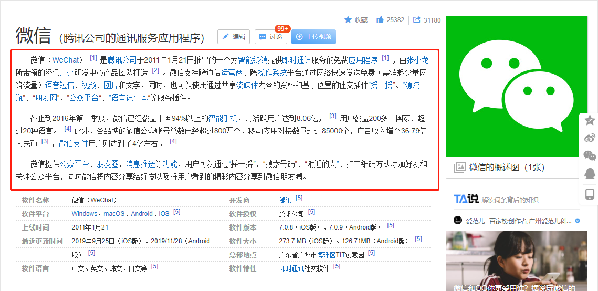

# 1. 任务

## 1.1 爬虫获取百科信息
100个app，爬取两个百科（百度百科，互动百科）的信息，需要爬取的信息为：

(1) Inforbox：
 

(2) 摘要：


## 1.2 结果保存
使用json格式保存结果，如：
```json
{
  "微信": {"软件名称": "微信(WeChat)", "软件平台": "Windows"},
  "QQ": {"软件名称": "QQ", "软件平台": "Windows"}
}
```


## 2. 论文阅读

(1) zhishi.me 论文

(2) Network Embedding综述论文